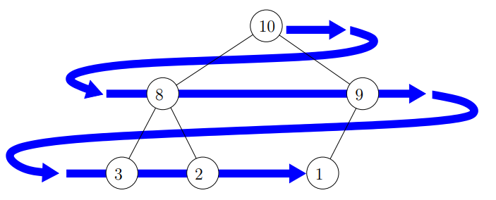

# BUILD BINARY HEAP
Имаме масив  A[1...n]. Искаме да разместим числата така, че масивът да стане пирамида. 

### 1. Въведение
Нека имаме попълнено двоично дърво с ключове T с корен u. Децата на u са v и w. Приемаме, че T[[v]] и T[[w]] са пирамиди.

  1. Ако u.key >= v.key u.key >= w.key, то T е пирамида. 
  2. Ако допуснем Б.О. О. u.key < v.key или u.key < w.key, тогава Т може да има много пирамидални инверсии (до n-1 на брой).

**Ключово е, че с O(lgn) размени можем да премахнем всички пирамидални инверсии.**

Трябва да разменим u с **ПО-ГОЛЕМИЯ** от върховете v и w.

Б.О.О. v.key < w.key. Тоест разменяме u с w. След размяната w няма да участва в инверсия с НИТО един връх от T[[v]]. Ако има инверсии, те ще са само в поддървото с корен u: T[[u]]. Откъдето инверсиите намаляват наполовина или повече. 

Има примери, в които може да разменим корена с по-малкото от двете деца за константна сложност. Но ако правим това, в най-лошия случай ще имаме линейна сложност. А ако разменяме с по-голямото сме сигурни, че сложността ще е най-много логаритмична.

# COMPLETE BINARY TREE
* Every level except perhaps the last one have the maximum possible number of vertices.
* If the leaves are on two levels the leaves on the last level are in left.
* height h, vertices n:  h = lgn
* count of leaves: n/2 , upper limit
* internal vertices: n/2 , lower limit
* count of vertices with height >= k:  n/(2^k), lower border
* count of vertices with height = k:  (n/(2^k))/2, upper border

# PERFECT BINARY TREE
* Completed binary tree in which all leaves are the same
level.

# BINARY HEAP
* max heap - parents > kids
* min heap - parents < kids
* A[1 ... n], A[i] - element with  addr i 
* A[i/2] - parent of element with addr i 
* A[2*i] - left kid of element with addres i
* A[2*i + 1] - right kid
* Pyramidal inversion: Any ordered pair of indexes <i, j> such that i < j, 
A[i] is ancestors of A[j] and A[i] < A[j]
* Direct inversion: Any pyramidal inversion <i,j> such that i = parent(j)
* Indirect: Inversions that are not direct
* The array of keys is a pyramid only if it has NO pyramidal inversions.

Example of Max Heap: Lectures on Algorithms, Minko Markov

  
